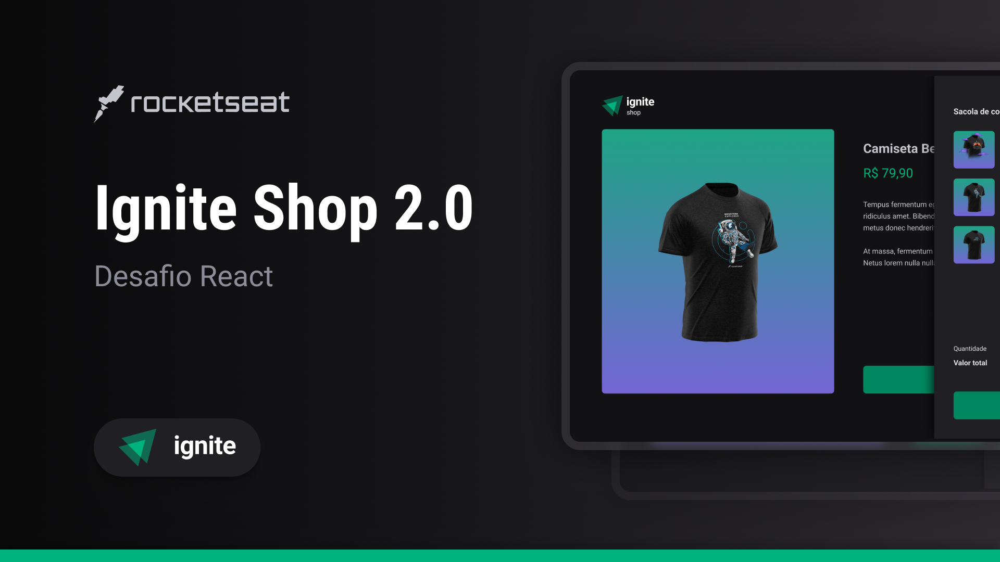

<div align="center" id="top">
  
</div>

<h1 align="center">Ignite Shop</h1>


<p align="center">
  <a href="#rocket-technologies">Technologies</a> &#xa0; | &#xa0;
  <a href="#white_check_mark-requirements">Requirements</a> &#xa0; | &#xa0;
  <a href="#checkered_flag-starting">Starting</a> &#xa0; | &#xa0;
  <a href="https://www.linkedin.com/in/dev-andradeleo" target="_blank">Author</a>
</p>


<br>
<br>


## :rocket: Technologies ##

The following tools were used in this project:

- Typescript
- Next
- Axios
- Stripe
- Keen-slider
- Stitches

<br>
<br>

## :white_check_mark: Requirements ##

Before starting :checkered_flag:, you need to have [Git](https://git-scm.com) and [Node](https://nodejs.org/en/) installed. And your firebase configurations!

## :checkered_flag: Starting ##

```bash
# Clone this project
$ git clone https://github.com/andradeleo/ignite-shop.git

# Install dependencies
$ npm install

# Run the project
$ npm run dev
```

<br>
<br>

Made with :heart: by <a href="https://github.com/andradeleo" target="_blank">andradeleo</a>

&#xa0;

<a href="#top">Back to top</a>
